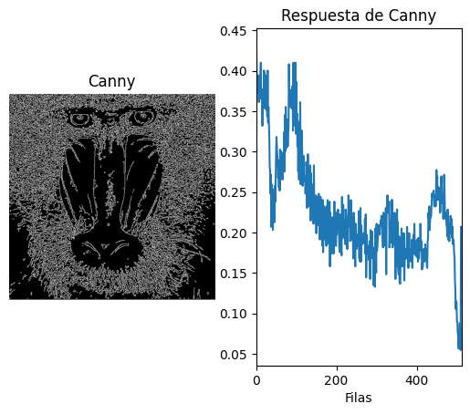
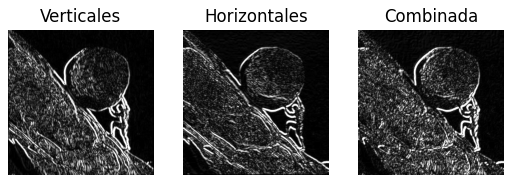
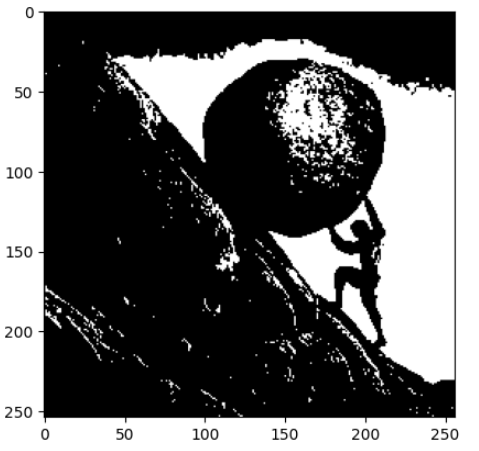
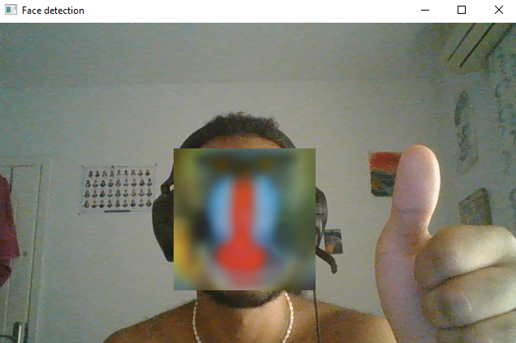

# P2-Funciones-basicas-OpenCV

## Desarrollo

### Píxeles blancos por filas y columnas
**Empleando funciones de NumPy y OpenCV se obtienen datos de la cantidad de píxeles de cada fila y columna.**
- `row_counts = cv2.reduce(canny, 1, cv2.REDUCE_SUM, dtype=cv2.CV_32SC1)`: Para la cuenta de píxeles blancos se utiliza esta función, la cual suma los valores de los píxeles a lo largo de una dimensión específica de la imagen canny. El resultado es una matriz que contiene como elementos la suma de los valores de píxeles para cada fila de la imagen.
- Luego se normalizan los valores de las sumas de píxeles en cada fila dividiendo cada valor en esa columna por el producto de 255 y el ancho de la imagen Canny.
- Se quita la última fila filtrándola por tener el mayor número de píxeles blancos  debido a que en este caso e un error que sean todo píxeles blancos esa fila.
- Ahora se calcula la nueva fila con más píxeles blancos con: `new_max = max(rows)`
- Se calcula el número de valores que superan 0'05 * maximo
  ```py
  threshold = 0.95 * new_max
  mask_threshold = rows >= threshold
  sum_big_vals = np.sum(mask_threshold)
  ```
- Finalmente el código muestra la imagen de canny y su gráfica

  

Imagen 1: Imagen del mendril después de aplicar el filtro
  
### Operador Sobel
**El código mumestra el resultado de una imágen a la que se le ha aplicado el operador Sobel.**

- Se lee la imagen desde el archivo y la convierte en formato RGB con al función: `cv2.cvtColor(img2, cv2.COLOR_BGR2RGB)`
- `gris = cv2.cvtColor(img_rgb, cv2.COLOR_BGR2GRAY)`: Convierte laimagen a escala de grises
- `cv2.GaussianBlur(gris, (3, 3), 0)`: Aplica un filtro de desenfque de Gauss
- Se usan operdorers de Sobel en las direcciones x e y para la detección de bordes verticales y horizontales:
  ```py
  sobelx = cv2.Sobel(ggris, cv2.CV_64F, 1, 0)  # x
  sobely = cv2.Sobel(ggris, cv2.CV_64F, 0, 1)  # y
  ```
- Se combinan los resultados de ambas utilizando la función `cv2.add` y se muestran los resultados con `plt.imshow(sobel, cmap='gray')` y con `plt.imshow(cv2.convertScaleAbs(sobel), cmap='gray')` ajustando la escala


Imagen 2: Imagen de Sobel sin ajuste de escala



Imagen 3: Imagen con el ajuste


### Umbralizado de imagen
**El código muestra una imagen resultante de Sobel a la que se le ha aplicado un umbralizado.**

- `res, umbralImg = cv2.threshold(gris, umbral, 255, cv2.THRESH_BINARY)`: Aplica umbralización a la imagen. Los píxeles con intensidades por encima de 100 se establecen en 255 (blanco) y los píxeles por debajo se establecen en 0 (negro)
- ```py
  row_counts = cv2.reduce(umbralImg, 1, cv2.REDUCE_SUM, dtype=cv2.CV_32SC1)
  rows = row_counts[:, 0] / (255 * umbralImg.shape[1])

  col_counts = cv2.reduce(umbralImg, 0, cv2.REDUCE_SUM, dtype=cv2.CV_32SC1)
  cols = col_counts[0] / (255 * umbralImg.shape[0])
  ```

  Calcula las sumas de píxeles a lo largo de las filas y columnas de la imagen umbralizada y luego normaliza estos valores.

- Calcula la cantidad de valores que superan 0'95 * máximo

- Luego se muestra la imagen resultante después de aplicar los filtros y se muestran los datos resultantes de cada filtro sobre la imagen



Imagen 4: Imagen de Sisifo tras el umbralizado
  
### Filtro Laplace
**El código muestra el uso de un filtro Laplace ya mostrado en la anterior práctica.**

- El codigo inicializa un objeto que representa la camara web y entra en un bucle en el que captura continuamente los frames de la camara.

- ```py
  kernel = np.array([
                    [0, -1,  0],
                    [-1,  4, -1],
                    [0, -1,  0]
                  ])
  ```
  Se defne la matriz de kernel laplaciana

  - `cv2.filter2D(frame, ddepth=-1, kernel=kernel)`: Se aplica el filtro Laplaciano a la imagen y posteriormente se muestra por pantalla

### Reconocimiento de caras
**El código muestra el uso de un Haar Cascade classifier para el reconocimiento de caras**

- `face_cascade = cv2.CascadeClassifier('haarcascade_frontalface_default.xml')`: Carga el clasificador Haar Cascade para la detección de caras.
- Convierte la imagen de la web cam a escala de griises
- `faces = face_cascade.detectMultiScale(gray, scaleFactor=1.1, minNeighbors=5, minSize=(30,30))`: Utiliza el clasificador Haar Cascade para detectar caras en la imagen en escala de grises
- Se itera sobre las coordenadas de las caras encontradas
-   - ```py
      mandril = cv2.resize(mandril, (w, h))
      frame[y:y+h, x:x+w] = mandril
      ```
      Redimensiona la imagen del mandril para que coincida con las dimensiones de la cara detectada y la coloca sobre la cara en el fotograma original


  

  Imagen 5: face detection
          
## Fuentes de información

Como ayudas para la realización de la práctica y la aplicación de un detector de objetos haciendo uso de OpenCV se han visitado estas páginas:
- [learnopencv](https://learnopencv.com/image-filtering-using-convolution-in-opencv/#gauss-blur-opencv)
- [Face Detection using Python and OpenCV](https://www.geeksforgeeks.org/face-detection-using-python-and-opencv-with-webcam/?ref=lbp)

Realizado por:
- Eduardo Etopa Lechuga
- Willy Escovilla Biason


